# remoteChatAppLLM

**Version:** 1.18  
**Developer:** xAPPS-Lab.ca  
**Website:** [android.xapps-lab.com](https://android.xapps-lab.com)  
**LinkedIn:** [jstaguan](https://www.linkedin.com/in/jstaguan)  
**Privacy Policy:** [androidapps.xapps-lab.com/privacy](https://androidapps.xapps-lab.com/privacy)

## APP Status:Under Internal Testing

Drop us your gmail to download your pre-release app from playstore.

Pre-Release Download: https://play.google.com/apps/internaltest/4700612420796748501

email: android.xappslab@gmail.com
---

## Core Features

- **Dual-engine AI** — switch at runtime between a local LM Studio instance and Google Gemini cloud API
- **Streaming responses** — token-by-token output via Server-Sent Events (SSE) on both engines
- **Multimodal chat** — attach any file from the system file manager; images sent as Base64
- **Markdown & code rendering** — built-in renderer with syntax highlighting (no third-party library)
- **Chat history** — multiple named sessions; swipe left from chat to browse and restore past conversations
- **Model capability icons** — vision / reasoning / tools indicators derived from model name
- **Server management** — add multiple LM Studio servers; models auto-detected via 10-second background poll
- **Local-first privacy** — all chat history, settings, and credentials stored on-device via Room + DataStore; no analytics or telemetry
- **AMOLED black theme** — pure black (#000000) background for battery savings on OLED displays
- **Samsung S25 Ultra optimized** — bottom-anchored input and reachability-friendly layout

---

## How to Configure LM Studio

1. Run LM Studio on your PC and load a model. Enable the local server (default port **1234**).
2. Open the app and tap the **Settings** icon (gear).
3. Select the **LM Studio** tab.
4. Tap **Add Server**, enter a nickname and the server's IP address (e.g. `http://192.168.1.x`), then confirm.
5. The server card shows a green **Online** badge when the ping succeeds.
6. **Tap the server card** to expand its model list, then select a model. The list closes automatically after selection.

> **Emulator note:** When testing on the Android emulator, the host machine is reachable at `169.254.xx.xx` or `10.0.2.2`.

> **Real device note:** Android 15 (API 35+) requires the `ACCESS_LOCAL_NETWORK` runtime permission for LAN access. The app requests this automatically on first launch.

---

## How to Configure Gemini API

1. Get an API key from [Google AI Studio](https://aistudio.google.com/app/apikey).
2. Open the app and tap the **Settings** icon.
3. Select the **Gemini CLI** tab.
4. Paste your API key and tap **Validate Key** to confirm it works.
5. Select your preferred model (default: **gemini-2.5-flash**).
6. Optionally set a system prompt, temperature, and top-P.

---

## App Screenshots

<table>
  <tr>
    <td align="center" colspan="3">
      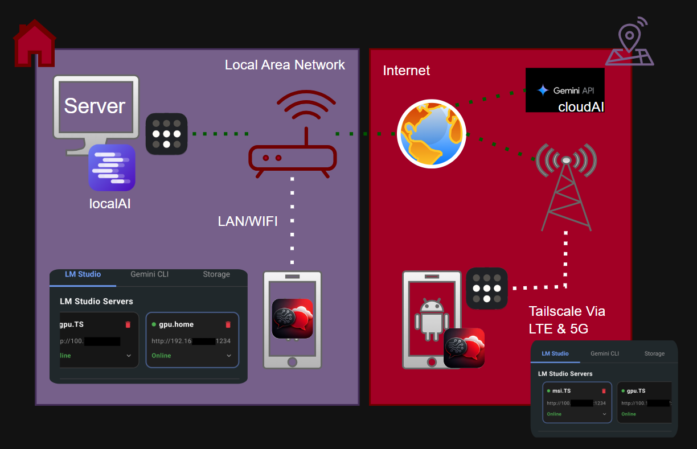 
      <b>Deployment Setup</b>
    </td>
  </tr>
  <tr>
    <td align="center" width="33%">
      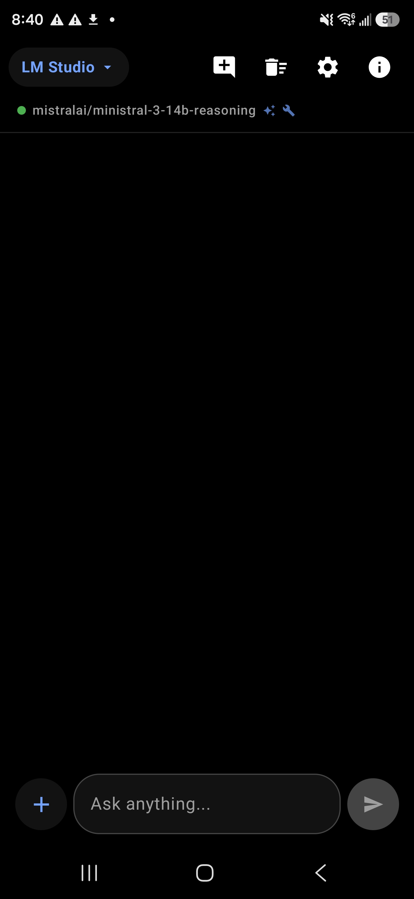 
      <b>LM Studio + Mistral AI</b>
    </td>
    <td align="center" width="33%">
      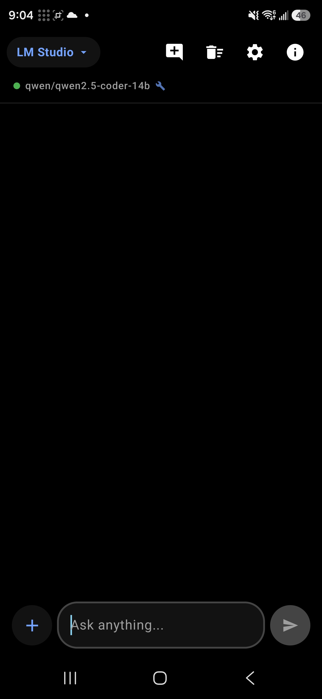 
      <b>LM Studio + Qwen</b>
    </td>
    <td align="center" width="33%">
      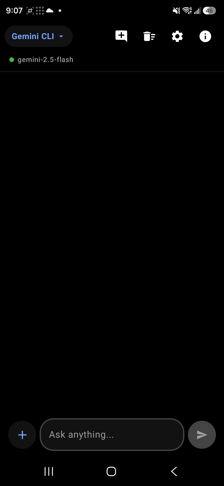 
      <b>Gemini Flash UI</b>
    </td>
  </tr>
  <tr>
    <td align="center" width="33%">
      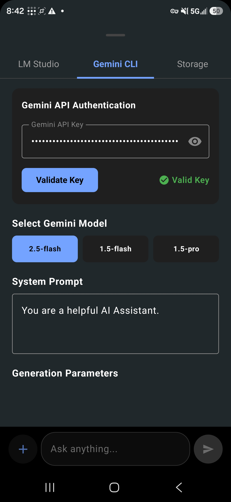 
      <b>Gemini API Key Setup</b>
    </td>
    <td align="center" width="33%">
      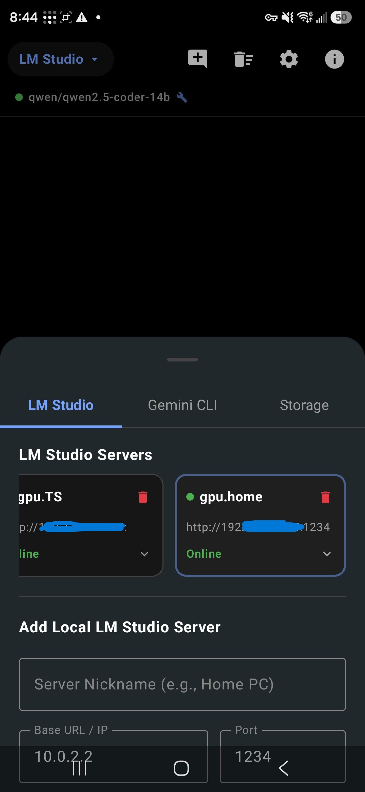 
      <b>LM Studio Server (LAN)</b>
    </td>
    <td align="center" width="33%">
      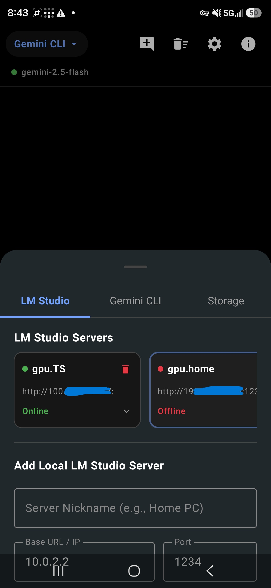 
      <b>LM Studio via Tailscale</b>
    </td>
  </tr>
  <tr>
    <td align="center" width="33%">
      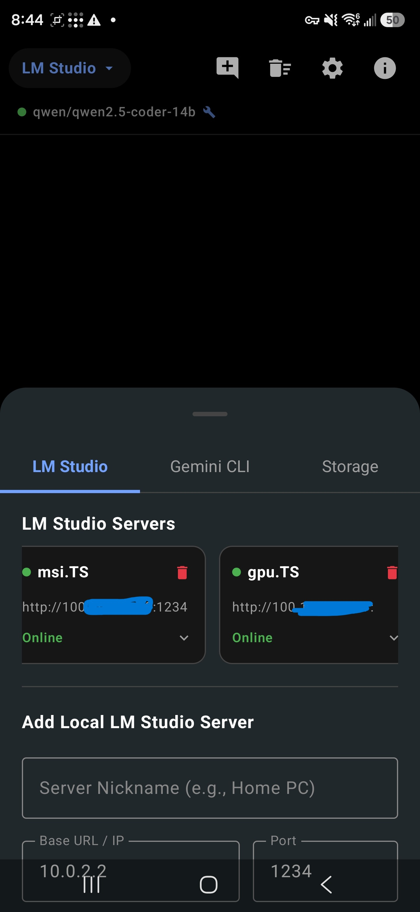 
      <b>Two Servers via Tailscale</b>
    </td>
    <td align="center" width="33%">
      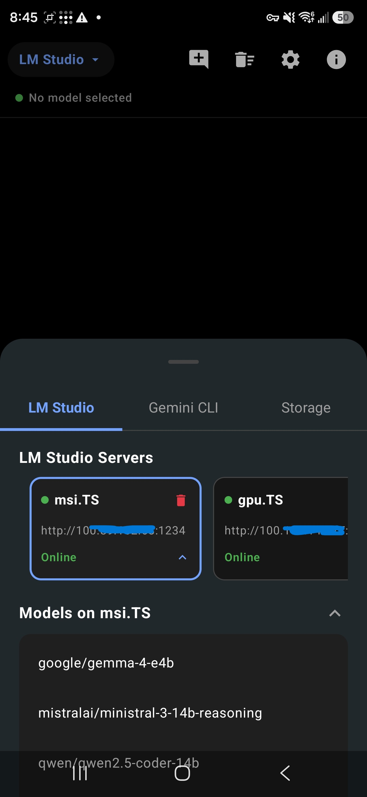 
      <b>Two Servers — Model List</b>
    </td>
    <td align="center" width="33%">
      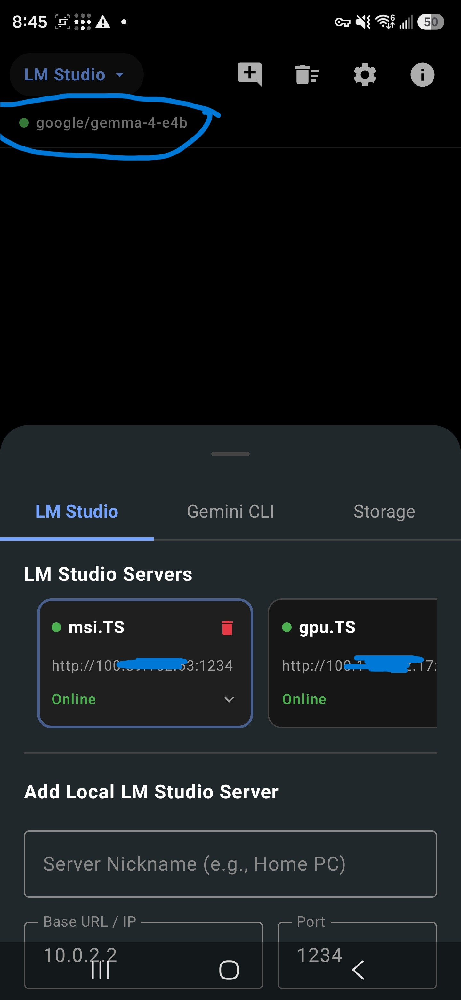 
      <b>Model Selected</b>
    </td>
  </tr>
  <tr>
    <td align="center" width="33%">
      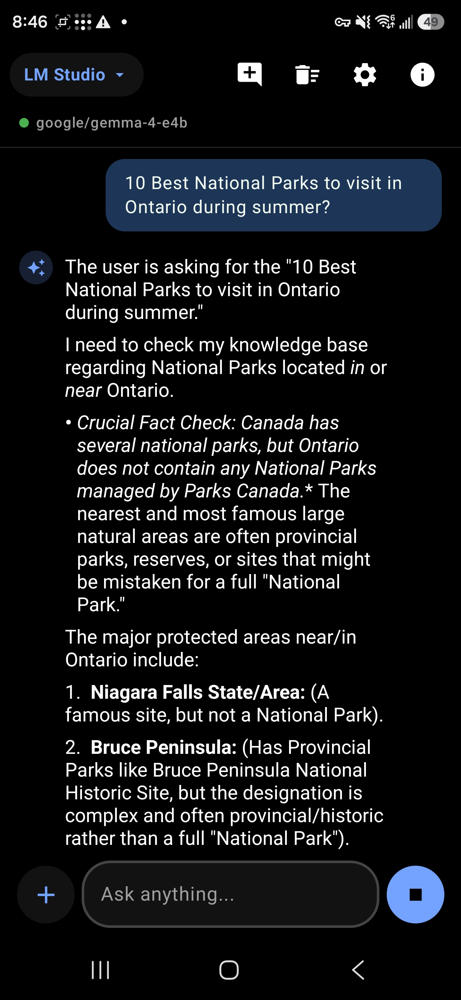 
      <b>Chat with Gemma 4B</b>
    </td>
    <td align="center" width="33%">
      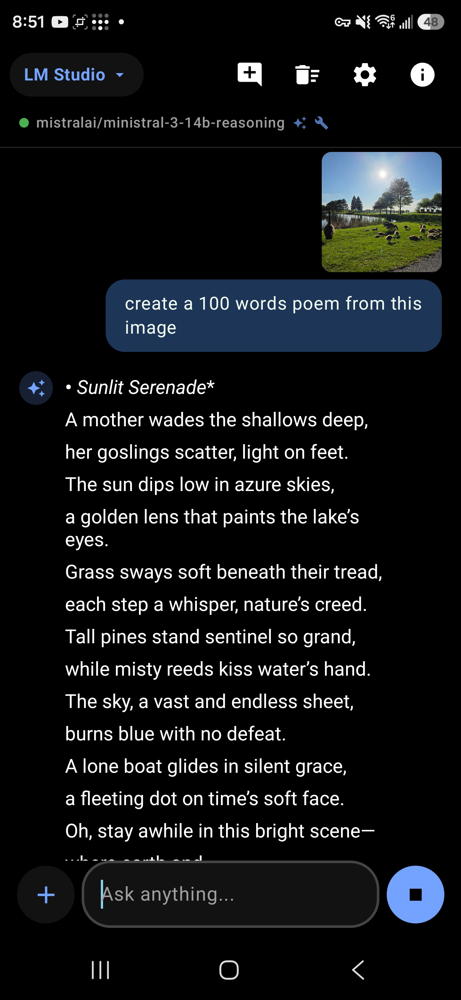 
      <b>Image Analysis (Mistral AI)</b>
    </td>
    <td align="center" width="33%">
      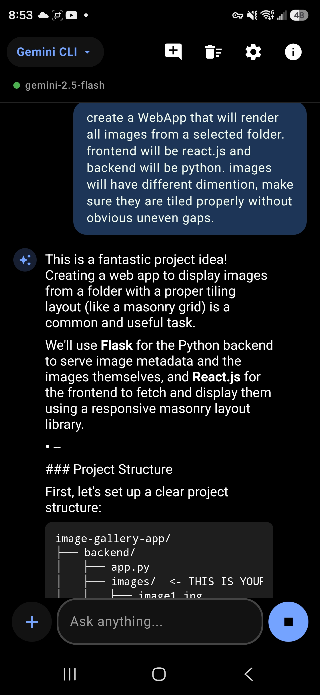 
      <b>Image Analysis (Gemini 2.5 Flash)</b>
    </td>
  </tr>
  <tr>
    <td align="center" width="33%">
      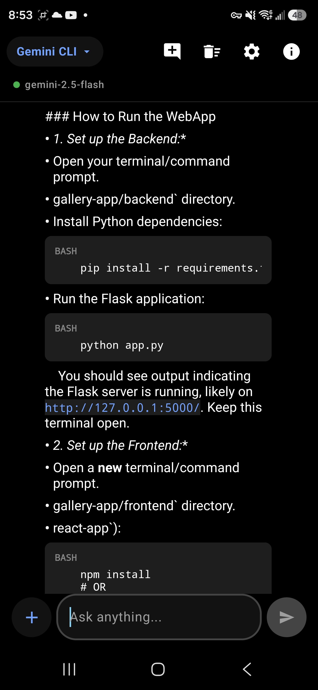 
      <b>Image Analysis — Detail View</b>
    </td>
    <td align="center" width="33%">
       
      <b>Local AI vs Cloud AI Toggle</b>
    </td>
    <td align="center" width="33%"></td>
  </tr>
</table>

---

## Release Notes

### v1.01
- Initial release: AMOLED black theme, dual-engine support (LM Studio + Gemini), Samsung S25 Ultra reachability optimizations
